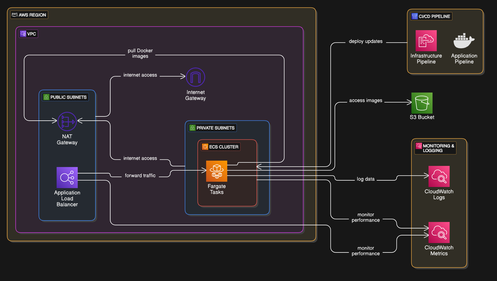

# Optimized ECS Cluster with Fargate Tasks and Blue/Green Deployment


This project sets up an optimized Amazon ECS (Elastic Container Service) cluster using AWS Fargate tasks. It includes auto-scaling, blue/green deployment, and integration with S3 for application assets. The infrastructure is deployed using AWS CloudFormation.

## Table of Contents
- [Overview](#overview)
- [Features](#features)
- [Prerequisites](#prerequisites)
- [Setup Instructions](#setup-instructions)
- [Local Development](#local-development)
- [CloudFormation Deployment](#cloudformation-deployment)
- [Application Configuration](#application-configuration)
- [Deployment Details](#deployment-details)
- [Monitoring and Logging](#monitoring-and-logging)

## Overview
This project automates the deployment of an ECS cluster with Fargate tasks for containerized applications. It supports:

- **Blue/Green Deployment**: Minimizes downtime during updates by deploying new versions alongside existing ones.
- **Auto-Scaling**: Dynamically scales tasks based on CPU and memory utilization.
- **S3 Integration**: Provides access to an S3 bucket for storing application assets.
- **Health Checks**: Ensures tasks are healthy before serving traffic.

## Features
- **AWS Fargate**: Serverless compute engine for running containers without managing servers.
- **Blue/Green Deployment**: Safe and reliable updates with zero-downtime deployments.
- **Auto-Scaling**: Configurable scaling policies for CPU and memory utilization.
- **Container Insights**: Integrated monitoring for ECS tasks and services.
- **Centralized Logging**: Logs are stored in Amazon CloudWatch for easy debugging.
- **Security**: IAM roles and security groups ensure secure access to resources.


## Architecture
The architecture consists of the following components:

- **ECS Cluster**: A logical grouping of tasks and services that run on Fargate.
- **Fargate Tasks**: Containers that run on Fargate with CPU and memory limits.
- **Application Load Balancer (ALB)**: Routes traffic to the ECS services.
- **Auto-Scaling Policies**: Dynamically scales tasks based on CPU and memory utilization.
- **CloudWatch Logs**: Centralized logging for ECS tasks and services.
- **S3 Bucket**: Stores application assets like images, videos, and other files.
- **IAM Roles**: Grants permissions to ECS tasks, services, and other resources.
- **Security Groups**: Controls inbound and outbound traffic to the ECS services.



## Prerequisites
Before you begin, ensure you have the following:

- **AWS Account**: An active AWS account with appropriate permissions.
- **AWS CLI**: Install and configure the [AWS CLI](https://aws.amazon.com/cli/).
- **Docker**: Install Docker for local testing.
- **Java**: Install Java Development Kit (JDK) for building the application.
- **Git**: Install Git for version control.

## Setup Instructions

### Local Development
1. **Clone the Repository**:
  ``` bash
  git clone https://github.com/AbuduSamadu/s3-gallery.git
  cd s3-gallery
  ```

2. **Build the Application**:
  ``` bash
    ./mvnw clean package
    docker build -t s3-gallery .
    
   ```
3. **Run the Application**: 
  ``` bash
    curl http://localhost:9090/heath
  docker run -p 9090:9090 s3-gallery
  ```
4. **Access the Application**: Open http://localhost:9090 in your browser.


### CloudFormation Deployment
1. **Install AWS CLI: Ensure the AWS CLI is installed and configured**: 
  ``` bash
  aws configure
  ```

2. **Deploy the Infrastructure**: 
  ``` bash
aws cloudformation deploy \
  --template-file ecs-fargate-blue-green.yaml \
  --stack-name my-ecs-stack \
  --parameter-overrides \
    EnvironmentName=dev \
    ECRRepositoryURI=<your-ecr-uri> \
    VPC=<your-vpc-id> \
    Subnets=<subnet-ids> \
    ECSSecurityGroup=<security-group-id> \
    ALBListenerArn=<alb-listener-arn> \
    s3BucketName=<s3-bucket-name>
   ```

3. **Deploy the Application**: 
  ``` bash
aws cloudformation describe-stacks --stack-name my-ecs-stack

   ```
